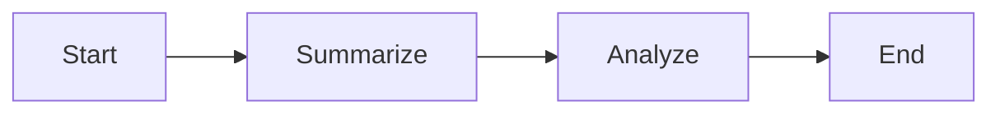

# ⚡️ Hypergraph Agents: Build Viral AI Workflows

[](https://github.com/jmanhype/hypergraph_agents_umbrella/actions)
[](#)
[](#)
[](LICENSE)

> **Multi-language, high-performance agentic AI framework for viral, distributed workflows.**

---

# 📚 Table of Contents
- [Showcase: All the Pieces](#showcase-all-the-pieces)
  - [Project Architecture](#project-architecture)
  - [A2A Protocol: Agent Communication](#a2a-protocol-agent-communication)
  - [Workflow Engine (XCS)](#workflow-engine-xcs)
  - [Operators: Plug & Play AI](#operators-plug--play-ai)
  - [Specification Protocol: Validation](#specification-protocol-validation)
  - [Model System: LLMs & More](#model-system-llms--more)
  - [Configuration System](#configuration-system)
  - [Directory Structure](#directory-structure)
  - [Multi-Language Agents](#multi-language-agents)
  - [Observability: Metrics & Dashboards](#observability-metrics--dashboards)
- [Viral Quickstart & Usage Story](#-imagine-this)
- [Why Hypergraph Agents?](#-why-hypergraph-agents)
- [Remixable Workflows](#-remixable-workflows)
- [Add Your Own AI](#-operators-add-your-own-ai)
- [Dev Experience](#-dev-experience)
- [End-to-End Example](#-example-run-a-workflow-python)
- [Contribute & Remix](#-contribute--remix)
- [Go Further](#-go-further)

---

# 🚩 Showcase: All the Pieces

## Project Architecture

```mermaid
graph TD
    User[(User/API)] --> API[Phoenix API]
    API --> XCS[Execution Engine (XCS)]
    XCS --> Operators
    Operators --> LLM[LLM/Model System]
    XCS --> EventBus[NATS/PubSub]
    EventBus --> PythonAgent[Python Agent]
    PythonAgent --> API
```

> **[Add GIF/Screenshot: Running a workflow, seeing results and metrics live]**

---

## A2A Protocol: Agent Communication

Agents send, receive, and negotiate tasks via a simple, powerful protocol:

```json
{
  "type": "task_request",
  "sender": "agent1",
  "recipient": "agent2",
  "payload": { "graph": { "nodes": [], "edges": [] } }
}
```

- **Endpoints:**
  - `POST /api/a2a` (Elixir)
  - `/api/a2a` (Python FastAPI)

> **[Add Mermaid Sequence Diagram: A2A Message Flow]**

---

## Workflow Engine (XCS)

- **Graph-based execution:** Parallel & sequential
- **Topological sorting:** Handles dependencies
- **Flexible:** YAML, Elixir, or Python workflows



- Run: `mix workflow.run workflows/summarize_and_analyze.yaml`

---

## Operators: Plug & Play AI

- **Built-in:** MapOperator, SequenceOperator, LLMOperator, ParallelOperator
- **Custom:**

```elixir
defmodule MyOperator do
  @moduledoc """Custom operator for viral workflows."""
  def run(input, _ctx), do: String.upcase(input)
end
```

- Generate: `mix a2a.gen.operator MyOperator`
- Test: `mix test`

---

## Specification Protocol: Validation

- **Input/output validation** for operators & workflows
- Example:

```elixir
@spec run(map(), map()) :: {:ok, map()} | {:error, String.t()}
def run(input, _ctx) do
  with :ok <- validate(input) do
    ...
  end
end
```

---

## Model System: LLMs & More

- **LLM integration** via `instructor_ex` (Elixir)
- **Easy to swap models/configs**
- Example:

```elixir
response = Model.call("Summarize this text", model: :gpt_4)
```

---

## Configuration System

- **Global & context-specific config**
- Uses `.env` or `config/*.exs`
- Example:

```elixir
config :a2a_agent_web, api_key: System.get_env("OPENAI_API_KEY")
```

---

## Directory Structure

```text
hypergraph_agents_umbrella/
  agents/
    python_agents/
      minimal_a2a_agent/
  apps/
    a2a_agent_web/
    engine/
    operator/
  config/
  ...
```

> **[Add Visual: Directory Tree or Screenshot]**

---

## Multi-Language Agents

- **Elixir & Python** communicate via A2A protocol
- Example: Python agent receives, processes, and replies to Elixir agent

> **[Add Mermaid Sequence Diagram: Elixir ↔ Python message]**

---

## Observability: Metrics & Dashboards

- **Prometheus metrics** at `/metrics`
- **Grafana dashboards** for real-time monitoring

> **[Add Screenshot/GIF: Metrics dashboard in action]**

---

## 🧑‍💻 Imagine This

You want to analyze, summarize, and remix data using both LLMs and custom logic—across Elixir and Python. Hypergraph Agents lets you:

- Define workflows visually (YAML/Elixir)
- Plug in your own operators or use built-ins
- Run from CLI, API, or Python/Elixir
- See results, remix, and scale—fast

---

### 1. **Define a Workflow (YAML or Elixir)**

```yaml
# workflows/summarize_and_analyze.yaml
nodes:
  - id: summarize
    operator: LLMOperator
    prompt: "Summarize this: {{input.text}}"
  - id: analyze
    operator: MapOperator
    function: "analyze_sentiment"
edges:
  - from: summarize
    to: analyze
```

---

### 2. **Add or Use an Operator**

Operators are plug-and-play. Use built-ins or add your own:

```elixir
defmodule MyOperator do
  @moduledoc """Custom operator for viral workflows."""
  def run(input, _ctx), do: String.upcase(input)
end
```

---

### 3. **Run the Workflow**

**CLI:**
```sh
mix workflow.run workflows/summarize_and_analyze.yaml
```

**API (Python):**
```python
import httpx
msg = {
    "type": "task_request",
    "sender": "pyagent1",
    "recipient": "agent1",
    "payload": {"task_id": "t1", "stream": True}
}
r = httpx.post("http://localhost:4000/api/a2a", json=msg)
print(r.json())
```

---

### 4. **See the Results**

```
{
  "result": {
    "summary": "This is the summary...",
    "analysis": "Positive"
  }
}
```

---

### 5. **Remix: Add More Agents, Operators, or Workflows**

- Generate a new operator: `mix a2a.gen.operator ViralOperator`
- Add a Python agent: see [`minimal_a2a_agent`](agents/python_agents/minimal_a2a_agent/README.md)
- Monitor metrics: `http://localhost:4000/metrics`

---

## 🏗️ How It Works

- **A2A Protocol:** Agents talk, negotiate, and collaborate.
- **Operators:** Modular, extensible, and cross-language.
- **Workflows:** YAML, Elixir, or Python—your choice.
- **Observability:** Metrics, logs, dashboards—built in.

---

## 📚 Go Further

- [Deep Dive: Operators & Workflows](apps/operator/README.md)
- [API Reference & Examples](apps/a2a_agent_web/README.md)
- [Contributing](CONTRIBUTING.md)

---

## 🚀 Why Hypergraph Agents?

- **Plug & Play AI:** Instantly connect Elixir & Python agents.
- **Workflow DSL:** Write, run, remix—YAML or Elixir, your call.
- **A2A Protocol:** Agents talk, negotiate, and collaborate.
- **Event Streaming:** Real-time, distributed, and fast (NATS, PubSub).
- **Observability:** Metrics, logs, dashboards—built in.
- **Zero-BS Onboarding:** Clone, run, remix. Done.

---

## 🏁 60-Second Quick Start

```sh
git clone https://github.com/jmanhype/hypergraph_agents_umbrella.git
cd hypergraph_agents_umbrella
make up   # Or: docker compose up --build
```

- Elixir API: http://localhost:4000
- Python Agent: http://localhost:5001
- Metrics: http://localhost:4000/metrics

---

## 🧩 Remixable Workflows

- **YAML or Elixir:**
  - `workflows/summarize_and_analyze.yaml`
  - `workflows/summarize_and_analyze.exs`
- **Generate your own:**
  - `mix a2a.gen.workflow my_workflow`
- **Run it:**
  - `mix workflow.run workflows/summarize_and_analyze.yaml`

---

## ⚙️ Operators: Add Your Own AI

- **Generate a new operator:**
  ```sh
  mix a2a.gen.operator ViralOperator
  ```
- **Drop in your logic:**
  - `lib/a2a_agent_web_web/operators/viral_operator.ex`
- **Test it:**
  - `mix test`

---

## 🌐 Agents Talk (A2A Protocol)

```json
{
  "type": "task_request",
  "sender": "agent1",
  "recipient": "agent2",
  "payload": { "graph": { "nodes": [], "edges": [] } }
}
```
- `POST /api/a2a` — Send messages, trigger workflows, negotiate.
- Works across Elixir, Python, and beyond.

---

## 🛠️ Dev Experience

- **Makefile Shortcuts:** `make up`, `make test`, `make lint`
- **Live reload:** Phoenix & FastAPI
- **OpenAPI docs:** [openapi.yaml](apps/a2a_agent_web/openapi.yaml)
- **All code is type-annotated & documented**

---

## 🧪 Example: Run a Workflow (Python)

```python
import httpx
msg = {
    "type": "task_request",
    "sender": "pyagent1",
    "recipient": "agent1",
    "payload": {"task_id": "t1", "stream": True}
}
r = httpx.post("http://localhost:4000/api/a2a", json=msg)
print(r.json())
```

---

## 🤝 Contribute & Remix

- Fork, branch, PR—let’s build viral AI together
- All tests must pass (`make test`, `mix test`, `pytest`)
- Follow [CONTRIBUTING.md](CONTRIBUTING.md) and `.ai/rules/python-dev.md`

---

## 📚 Learn More

- [A2A Protocol](apps/a2a_agent_web/README.md#a2a-protocol-message-schema)
- [Operator Library](apps/operator/README.md)
- [Minimal Python Agent](agents/python_agents/minimal_a2a_agent/README.md)
- [Engine & Workflow DSL](apps/engine/README.md)

---

## 🦾 Viral AI Starts Here

Unleash distributed, agentic intelligence. Remix, extend, and connect your own operators, workflows, and agents—across any language.

---

MIT License | Built with Elixir, Python, and love.
