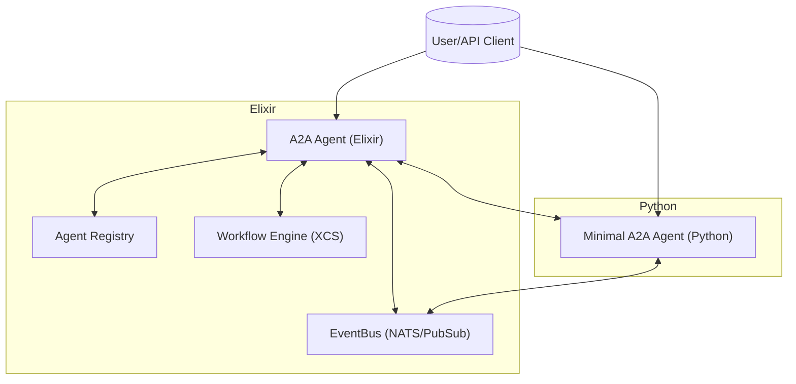
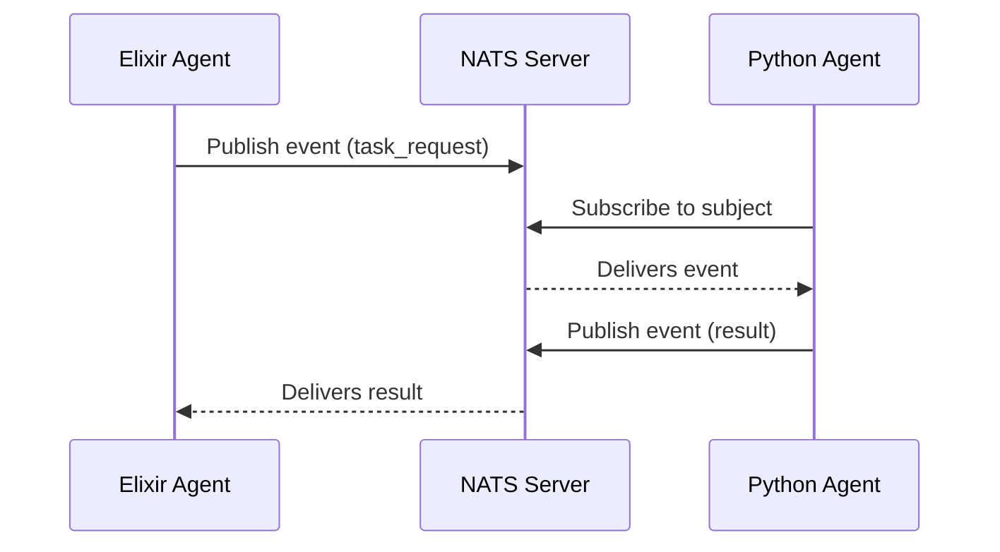
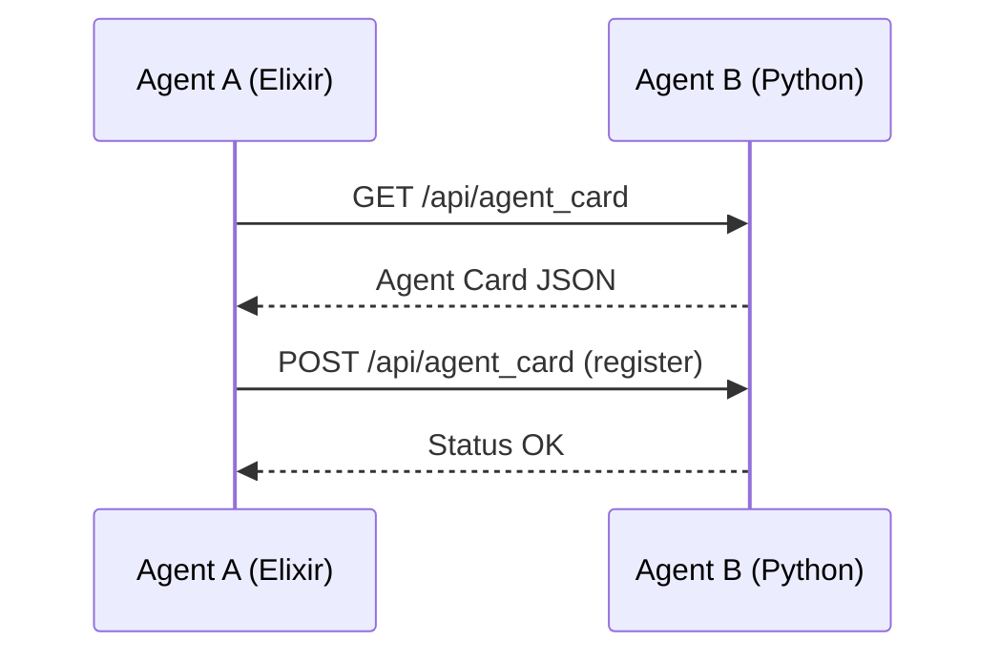

# Hypergraph Agents Umbrella

[](https://github.com/<your-org>/hypergraph_agents_umbrella/actions/workflows/ci.yml)
[](#)
[](#)
[](https://hexdocs.pm/)
[](https://github.com/<your-org>/hypergraph_agents_umbrella/releases)
[](https://hex.pm/packages/a2a_agent_web)
[](https://pypi.org/project/minimal-a2a-agent/)
[](#)
[](#)
[](LICENSE)

> **A multi-language, high-performance agentic AI framework for distributed workflows and A2A (Agent-to-Agent) communication in Elixir and Python.**

---

## Overview

Hypergraph Agents is a modular, extensible platform for building, orchestrating, and connecting intelligent agents across languages and runtimes. It provides:
- **A2A protocol** for secure, structured agent messaging and negotiation
- **Distributed event streaming** (NATS, Phoenix PubSub)
- **Workflow engine** for graph-based, parallel, and sequential execution
- **Workflow parsing and Control Flow Graph (CFG) support** for ingesting LLM-generated or hand-written workflow specs (see below)
- **Multi-language agent support** (Elixir, Python, more coming)
- **Observability** (Prometheus, OpenTelemetry, structured logging)
- **Robust developer experience** with clear APIs, tests, and docs

---

## Table of Contents
- [Overview](#overview)
- [Directory Structure](#directory-structure)
- [Architecture](#architecture)
- [Quick Start](#quick-start)
- [DevOps & Local Development](#devops--local-development)
- [Multi-Language Agent Support](#multi-language-agent-support)
- [A2A Protocol: Message Schema](#a2a-protocol-message-schema)
- [Workflow Parsing & CFG Support](#workflow-parsing--cfg-support)
- [API Examples](#api-examples)
- [Contributing](#contributing)
- [License](#license)

---

Hypergraph Agents is a modular, extensible platform for building, orchestrating, and connecting intelligent agents across languages and runtimes. It provides:
- **A2A protocol** for secure, structured agent messaging and negotiation
- **Distributed event streaming** (NATS, Phoenix PubSub)
- **Workflow engine** for graph-based, parallel, and sequential execution
## Project Structure & Documentation

- **[A2A Agent Umbrella](a2a_agent_umbrella/README.md)** — Umbrella project management
- **[A2A Agent (core)](a2a_agent_umbrella/apps/a2a_agent/README.md)** — Elixir agent protocol logic
- **[A2A Agent Web](a2a_agent_umbrella/apps/a2a_agent_web/README.md)** — Phoenix API (endpoints: `/api/story`, `/api/summarize`, `/api/a2a`, `/metrics`, `/status`)
- **[Engine](apps/engine/README.md)** — Workflow/XCS execution engine, **now with workflow parser and Control Flow Graph (CFG) support**
- **[HypergraphAgent](apps/hypergraph_agent/README.md)** — Orchestrator and workflow manager
- **[Operator](apps/operator/README.md)** — Operator library (LLM, Map, Sequence, Parallel)
- **[Minimal Python Agent](agents/python_agents/minimal_a2a_agent/README.md)** — Python FastAPI reference agent
- **[Goldrush Event System](apps/a2a_agent_web/README_GOLDRUSH.md)** — Event/telemetry integration
- **[NATS Integration](apps/a2a_agent_web/README_NATS.md)** — Event streaming and distributed messaging

See each README for detailed usage, architecture, and API documentation.

---

## Developer Goodies

### OpenAPI/Swagger Docs
- **OpenAPI schema:** [openapi.yaml](a2a_agent_umbrella/apps/a2a_agent_web/openapi.yaml)
- Use [Swagger Editor](https://editor.swagger.io/) to visualize or test the API.

### OpenAPI/Swagger Docs
- **OpenAPI schema:** [openapi.yaml](a2a_agent_umbrella/apps/a2a_agent_web/openapi.yaml)
- Use [Swagger Editor](https://editor.swagger.io/) to visualize or test the API.

### Badges
-  — Automated tests & linting
-  — Code coverage (see CI logs)
-  — [HexDocs](https://hexdocs.pm/) (Elixir docs)

### API Endpoint Table
| Endpoint             | Method | Description                       | Controller           |
|----------------------|--------|-----------------------------------|----------------------|
| `/api/story`         | POST   | Generate a story with LLM         | StoryController      |
| `/api/summarize`     | POST   | Summarize text with LLM           | SummarizerController |
| `/api/a2a`           | POST   | A2A protocol message              | A2aController        |
| `/metrics`           | GET    | Prometheus metrics                | MetricsController    |
| `/status`            | GET    | Health/status check               | StatusController     |

### Scripts & Commands
- **Makefile Shortcuts**: Run `make help` for a full list. Common:
  - `make up` / `make down`: Start/stop the full stack (Elixir, Python, NATS, Prometheus, Grafana)
  - `make test`, `make test-elixir`, `make test-python`: Run all or language-specific tests
  - `make lint`: Lint/format all code
- **Run tests manually**:
  - Elixir: `cd apps/a2a_agent_web && mix test`
  - Python: `cd agents/python_agents/minimal_a2a_agent && pytest`
- **Lint/format manually**:
  - Elixir: `mix format`
  - Python: `ruff check .`

### Troubleshooting
- **NATS not running?** See [README_NATS.md](apps/a2a_agent_web/README_NATS.md)
- **Metrics not showing?** Confirm `/metrics` endpoint and Prometheus config
- **Common errors**: See logs for `[EventBus]`, `[A2A]`, and `[LLMOperator]` messages
- **Docker issues**: `docker compose logs` and `docker compose ps` are your friends

### Documentation
- **Code-level docs**: [HexDocs](https://hexdocs.pm/) (Elixir), Python docstrings
- **API usage**: See [A2A Agent Web README](a2a_agent_umbrella/apps/a2a_agent_web/README.md) for curl/httpx examples
- **How to add an operator**: See [Operator README](apps/operator/README.md)
- **How to add an agent**: See [Minimal Python Agent README](agents/python_agents/minimal_a2a_agent/README.md)

### Security & Releases
- **Security Policy**: See [SECURITY.md](SECURITY.md) (if present)
- **Changelog**: See [CHANGELOG.md](CHANGELOG.md) for release notes

### Contribution & Community
- **Contribution Guidelines**: [CONTRIBUTING.md](CONTRIBUTING.md), `.ai/rules/python-dev.md`
- **Open Issues/PRs**: [GitHub Issues](https://github.com/<your-org>/hypergraph_agents_umbrella/issues)
- **Discussions/Support**: [GitHub Discussions](https://github.com/<your-org>/hypergraph_agents_umbrella/discussions) or open a PR/issue

### More
- **Pre-configured Docker Compose** for local dev and CI
- **Live reload**: Phoenix and FastAPI both support live reload for rapid iteration
- **Prometheus/Grafana**: Built-in metrics and dashboards
- **Type-annotated, docstring-rich code**: All Elixir and Python code follows strict typing and documentation conventions (see `.ai/rules/python-dev.md`)
- **Extensible Operators**: Easily add new operators for LLMs, workflows, or custom logic
- **Cross-language support**: Extend with agents in any language via the A2A protocol

For more, see the [Contributing](#contributing) section and individual app READMEs.

---

## Directory Structure

```
hypergraph_agents_umbrella/
  agents/
    python_agents/
      minimal_a2a_agent/   # Reference Python A2A agent
  apps/
    a2a_agent_web/        # Main Elixir A2A agent
    ...
  config/                 # System config
  ...
```

---

## Architecture



---

## More Diagrams

### Event Streaming Sequence Diagram



### Agent Registration Flow



---

## Quick Start

### 1. Clone & Install
```sh
git clone <this-repo-url>
cd hypergraph_agents_umbrella
```

### 2. Start Elixir Agent
```sh
cd apps/a2a_agent_web
mix deps.get
mix phx.server
```

### 3. Start Python Agent
```sh
cd agents/python_agents/minimal_a2a_agent
python -m venv .venv
source .venv/bin/activate
pip install -r requirements.txt
uvicorn app.main:app --reload --port 5001
```

---

## DevOps & Local Development

Hypergraph Agents ships with a modern developer experience for local development, testing, and CI/CD:

### Docker Compose
- **Spin up the entire stack (Elixir agent, Python agent, NATS, Prometheus, Grafana) with one command:**
  ```sh
  make up
  # or
  docker compose up --build
  ```
- **Stop everything:**
  ```sh
  make down
  # or
  docker compose down
  ```

### Makefile Automation
- **Run all tests (Elixir & Python):**
  ```sh
  make test
  ```
- **Run only Elixir or Python tests:**
  ```sh
  make test-elixir
  make test-python
  ```
- **Lint/format check for both stacks:**
  ```sh
  make lint
  ```

### CI/CD
- **GitHub Actions** runs all tests for both agents on every push and pull request (see [.github/workflows/ci.yml](.github/workflows/ci.yml)).
- Ensures cross-language compatibility and prevents regressions.

### Observability
- **Prometheus** scrapes metrics from both agents.
- **Grafana** available at [http://localhost:3000](http://localhost:3000) (default login: `admin`/`admin`).
- Prometheus config in [`config/prometheus.yml`](config/prometheus.yml).

### Developer Workflow
1. Clone the repo and start the stack: `make up`
2. Develop in Elixir or Python (hot reload supported)
3. Run tests: `make test`
4. Monitor metrics at [http://localhost:9090](http://localhost:9090) (Prometheus) and [http://localhost:3000](http://localhost:3000) (Grafana)
5. Open a PR—CI will run all tests automatically

---

## API Examples

### Register Python Agent with Elixir (cURL)
```sh
curl -X POST http://localhost:4000/api/agent_card \
  -H "Content-Type: application/json" \
  -d @agents/python_agents/minimal_a2a_agent/agent_card.json
```

### Send A2A Task Request (Python)
```python
import httpx
msg = {
    "type": "task_request",
    "sender": "pyagent1",
    "recipient": "agent1",
    "payload": {"task_id": "t1", "stream": True}
}
r = httpx.post("http://localhost:4000/api/a2a", json=msg)
print(r.json())
```

### Send A2A Task Request (Elixir)
```elixir
msg = %{
  type: "task_request",
  sender: "agent1",
  recipient: "pyagent1",
  payload: %{task_id: "t1", stream: true}
}
HTTPoison.post!("http://localhost:5001/api/a2a", Jason.encode!(msg), ["Content-Type": "application/json"])
```

### Streaming Task Progress (cURL)
```sh
curl -N -X POST http://localhost:5001/api/a2a \
  -H "Content-Type: application/json" \
  -d '{"type": "task_request", "sender": "agent1", "recipient": "pyagent1", "payload": {"task_id": "t1", "stream": true}}'
```

### Agent Discovery (Python)
```python
import httpx
msg = {
    "type": "agent_discovery",
    "sender": "agent1",
    "recipient": "pyagent1",
    "payload": {}
}
r = httpx.post("http://localhost:5001/api/a2a", json=msg)
print(r.json())
```

### Error Handling Example (Elixir)
```elixir
msg = %{type: nil, sender: "agent1", recipient: "pyagent1", payload: %{}}
HTTPoison.post!("http://localhost:5001/api/a2a", Jason.encode!(msg), ["Content-Type": "application/json"])
# => Returns 400 with error message
```

---

## Multi-Language Agent Support

- **Elixir Agent:** Full-featured, with A2A protocol, registry, event streaming, metrics, and workflow engine.
- **Python Agent:** Minimal, A2A-compliant FastAPI implementation for interoperability and testing.
  - See [`agents/python_agents/minimal_a2a_agent/README.md`](agents/python_agents/minimal_a2a_agent/README.md) for details.

### Cross-Language Integration
- Agents can register with each other via `/api/agent_card`.
- Agents exchange A2A messages via `/api/a2a` (supports streaming).
- See [test_a2a_interop.py](agents/python_agents/minimal_a2a_agent/test_a2a_interop.py) for Python <-> Elixir tests.

---

## A2A Protocol: Message Schema

## A2A API Documentation

### Message Schema

| Field      | Type     | Required | Description                                 | Example                |
|------------|----------|----------|---------------------------------------------|------------------------|
| type       | atom     | Yes      | Message type (`:task_request`, `:result`, `:status_update`, `:agent_discovery`, `:negotiation`) | `"task_request"`       |
| sender     | string   | Yes      | Agent ID or card                            | `"agent1"`             |
| recipient  | string   | Yes      | Agent ID or card                            | `"agent2"`             |
| payload    | map      | Yes      | Message-specific data (see below)           | `%{graph: ..., ...}`   |
| task_id    | string   | No       | Task identifier                             | `"task-123"`           |
| timestamp  | string   | No       | ISO8601 timestamp                           | `"2025-04-19T01:40:00Z"`|

#### Example: Task Request

```json
{
  "type": "task_request",
  "sender": "agent1",
  "recipient": "agent2",
  "payload": {
    "graph": { "nodes": [], "edges": [] },
    "agent_map": {},
    "input": {}
  },
  "task_id": "task-123",
  "timestamp": "2025-04-19T01:40:00Z"
}
```

#### Example: Agent Discovery

```json
{
  "type": "agent_discovery",
  "sender": "agent1",
  "recipient": "agent2",
  "payload": {}
}
```
**Stub Response:**
```json
{
  "status": "ok",
  "info": "Agent discovery message received (stub)"
}
```

#### Example: Negotiation

```json
{
  "type": "negotiation",
  "sender": "agent1",
  "recipient": "agent2",
  "payload": {"proposal": "foo", "details": {}}
}
```
**Stub Response:**
```json
{
  "status": "ok",
  "info": "Negotiation message received (stub)"
}
```

#### Error Response Example

```json
{
  "status": "error",
  "error": "Missing required fields: type, sender, recipient, payload"
}
```

### Endpoints

#### `GET /api/agent_card`
Returns agent metadata for discovery.

**Response Example:**
```json
{
  "name": "A2A Agent",
  "version": "0.1.0",
  "description": "Phoenix A2A agent interface"
}
```

#### `POST /api/a2a`
Receives an A2A message, validates it, and triggers agent orchestration. Returns results or errors as JSON.

---

## Contributing

We welcome contributions! To get started:
- Fork the repo and create a feature branch
- Follow our [coding standards](.ai/rules/python-dev.md) and use type annotations, docstrings, and tests
- Use `make lint` and `make test` before submitting a PR
- For major changes, open an issue to discuss first
- See [CONTRIBUTING.md](CONTRIBUTING.md) for detailed guidelines (if present)

### Advanced Guidelines
- All Python and Elixir code must use typing annotations and descriptive docstrings (PEP257 for Python).
- All new features and bugfixes require tests. Use `pytest` for Python and `mix test` for Elixir.
- Place all tests in `/test` or `/tests` directories and ensure they are fully type-annotated.
- Use `ruff` for Python linting and `mix format` for Elixir formatting.
- Document new endpoints or protocol changes in the relevant Markdown files.
- All configuration should use environment variables and be documented in the README or `docs/configuration.md`.
- Major changes should be discussed in an issue before submitting a PR.
- See `.ai/rules/python-dev.md` for AI-friendly coding practices and contribution rules.

---

## Monitoring & Observability

### Prometheus Metrics

This agent exposes a Prometheus-compatible metrics endpoint at:

- `GET /metrics`

You can scrape this endpoint using Prometheus and visualize metrics in Grafana or similar dashboards.

#### Example Metrics Exposed
- `a2a_messages_total{type="task_request"}` — Total A2A messages received by type
- `a2a_orchestrations_total` — Total orchestrations executed
- `a2a_negotiations_total{result="accepted|rejected"}` — Negotiations by result
- `a2a_errors_total` — Error responses

#### Example Prometheus scrape config
```yaml
scrape_configs:
  - job_name: 'a2a_agent_web'
    static_configs:
      - targets: ['localhost:4000']  # Replace 4000 with your port
    metrics_path: /metrics
```

#### How to Use
1. Start your Phoenix app (`mix phx.server`).
2. Visit `http://localhost:4000/metrics` to view metrics.
3. Add the above scrape config to your Prometheus `prometheus.yml`.
4. Build dashboards/alerts in Grafana as needed.

For more details, see the source in `a2a_agent_web/lib/a2a_agent_web_web/a2a_message.ex` and controller logic.

