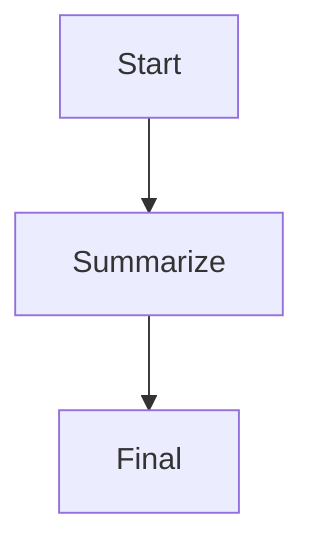
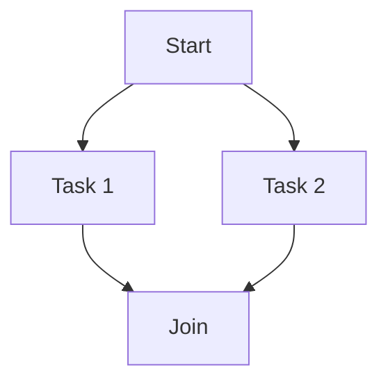

# Engine

This app implements the workflow execution engine (XCS) for Hypergraph Agents. It provides graph-based execution, topological sorting, and support for both parallel and sequential workflows.

## Purpose
- Executes agent workflows as directed acyclic graphs (DAGs)
- Resolves dependencies and supports parallelization for efficiency
- Core to orchestrating complex agentic tasks and multi-step LLM chains

## Architecture & Features
- **XCS (Execution Engine):**
  - Graph-based execution with parallelization
  - Topological sorting for dependency resolution
  - Supports both sequential and parallel execution modes
  - Groups nodes by level for efficient parallel execution
  - Handles node dependencies and execution order
- **DAG Workflow:**
  - Each node is an operator or agent task
  - Edges define data or control dependencies
- **Integration:**
  - Used by orchestrator and agent apps for workflow execution

## Example Workflow
```elixir
# Define a simple workflow DAG
graph = %{
  nodes: [
    %{id: :start, op: :input},
    %{id: :summarize, op: :llm, depends_on: [:start]},
    %{id: :final, op: :output, depends_on: [:summarize]}
  ],
  edges: [
    %{from: :start, to: :summarize},
    %{from: :summarize, to: :final}
  ]
}

# Execute the workflow
graph_result = Engine.run(graph, input: %{text: "Long document..."})
```

## Parallel vs Sequential Execution
- The engine analyzes the graph and executes independent nodes in parallel
- Sequential dependencies are enforced via topological sorting

## Extending the Engine
- Add new operator types or execution strategies in `lib/engine/`
- Plug in custom scheduling or monitoring logic

## Diagrams

### Example DAG


### Parallel Execution


## How Orchestration and Execution Work Together

The Engine and HypergraphAgent work together to enable flexible, scalable agentic workflows:

- **HypergraphAgent** acts as the **orchestrator** ("planner"). It builds workflow graphs (DAGs), decides which operators/agents to use, and manages high-level logic.
- **Engine** is the **executor** ("runtime"). It takes the workflow graph from HypergraphAgent and efficiently executes it, handling dependencies and parallelism.

**Analogy:**
- HypergraphAgent is the conductor/planner; Engine is the orchestra/player.
- HypergraphAgent decides *what* needs to be done and *how* to structure it; Engine handles *how* to run it efficiently.

| Component        | Main Responsibility                | Knows About         | Doesn’t Know About           |
|------------------|-----------------------------------|---------------------|------------------------------|
| Engine           | Execute workflow graphs (DAGs)     | Task dependencies, execution order | Business logic, API, orchestration |
| HypergraphAgent  | Build/orchestrate workflows        | Workflow logic, operator selection | Execution details, parallelism mechanics |

**Typical Flow:**
1. HypergraphAgent receives a high-level task (e.g., API request)
2. It builds a workflow graph (DAG) and selects operators/agents
3. It passes the graph to the Engine
4. Engine executes the graph, handling dependencies and parallelism
5. HypergraphAgent processes results or triggers further workflows

---

## Related Docs
- [Orchestrator App](../hypergraph_agent/README.md)
- [Operator App](../operator/README.md)
- [Umbrella README](../../a2a_agent_umbrella/README.md)

---

For architecture, usage, and API details, see the main [README](../../README.md).

