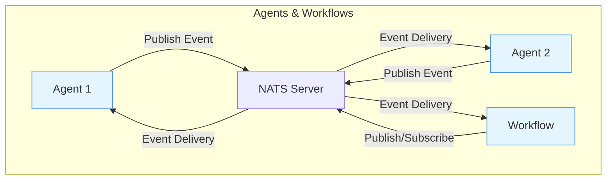
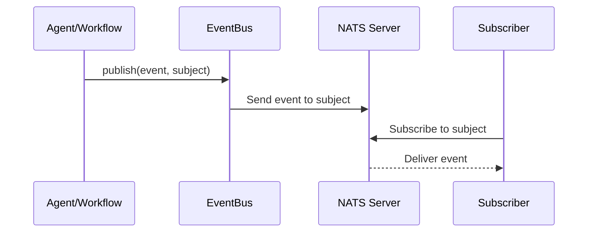

# Event Streaming Architecture (NATS)

This document provides an overview of the event-driven architecture in the `a2a_agent_web` application, including diagrams and documentation for agent communication via NATS.

---

## Architecture Diagram



---

## Event Flow

1. **Agents and workflows** publish events to NATS subjects (topics) using the `EventBus` module.
2. **NATS** delivers events to all subscribers of the subject.
3. **Agents and workflows** can subscribe to subjects to receive events in real time.

---

## EventBus API

- `publish(event :: map(), subject :: String.t())` – Publishes an event (as JSON) to a NATS subject.
- `subscribe(subject :: String.t())` – Subscribes the current process to a NATS subject.

---

## Event Schema Examples

Events are sent as JSON-encoded maps. All keys are strings when received from NATS. Use descriptive `type` fields to distinguish event kinds.

### Agent Status Event
```json
{
  "type": "agent_status",
  "agent_id": "abc123",
  "status": "ready",
  "timestamp": "2025-04-19T11:22:00Z"
}
```

### Workflow Completed Event
```json
{
  "type": "workflow_completed",
  "workflow_id": "wf_456",
  "result": "success",
  "duration_ms": 1234,
  "timestamp": "2025-04-19T11:23:00Z"
}
```

### Error Event
```json
{
  "type": "error",
  "source": "agent",
  "agent_id": "abc123",
  "message": "Failed to process input",
  "code": 500,
  "timestamp": "2025-04-19T11:23:01Z"
}
```

---

## Common Event Subjects

| Subject                   | Description                      |
|--------------------------|----------------------------------|
| `a2a.events`             | General events                    |
| `a2a.agent.status`       | Agent status updates              |
| `a2a.workflow.completed` | Workflow completion notifications |
| `a2a.errors`             | Error events                      |

All subjects are strings. Use dot-separated namespaces for clarity and filtering.

---

## Sequence Diagram: Publish/Subscribe Lifecycle



---

## Subject Naming Convention

- All subjects are strings, e.g., `a2a.events`, `a2a.agent.status`, `a2a.workflow.completed`
- Use dot-separated namespaces for clarity and filtering

---

## Logging & Troubleshooting

- All publish/subscribe actions and errors are logged with the `[EventBus]` tag.
- Check logs for connection status, failures, and received events.

---

## Further Reading
- [NATS Documentation](https://docs.nats.io/)
- [Elixir Gnat Library](https://hexdocs.pm/gnat/readme.html)

---

For questions or architecture changes, update this document and the diagrams as needed.
